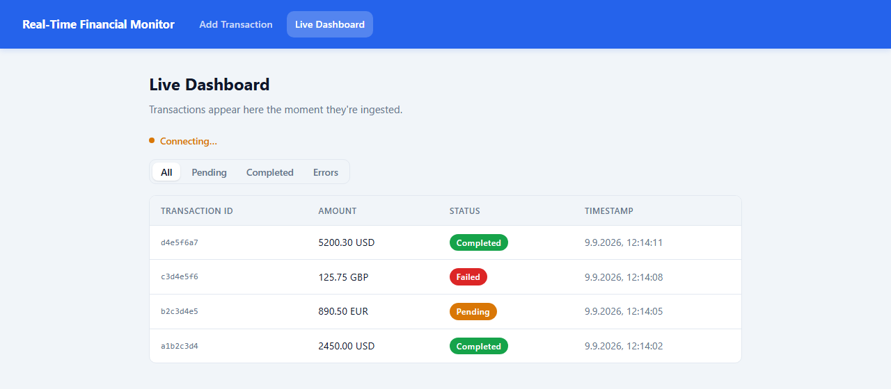
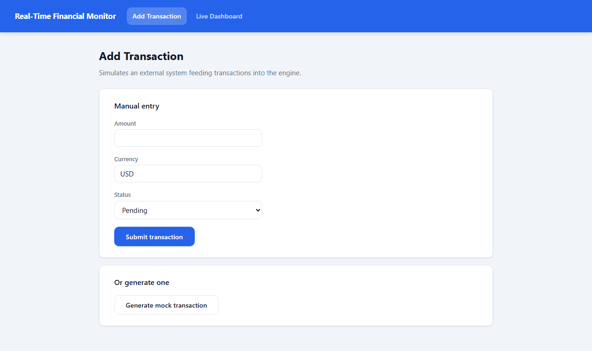

# Real-Time Financial Monitor

A support-agent dashboard that has to stay live: transactions land over HTTP,
get processed and stored under real concurrent load, and reach every connected
browser over WebSockets fast enough that a 100-transaction burst never freezes
the UI. Backend is ASP.NET Core (.NET 8) with SignalR; frontend is React +
TypeScript.

<table>
<tr>
<td width="50%">

**Live dashboard** (`/monitor`)


</td>
<td width="50%">

**Transaction simulator** (`/add`)


</td>
</tr>
</table>

## What makes this more than a CRUD demo

- **Thread safety is proven, not assumed.** The in-memory store is exercised by
  real `Parallel.ForEach`/`Parallel.Invoke` concurrency tests asserting actual
  invariants (no lost writes, no duplicate IDs, no corrupted reads mid-write) —
  not just "it has a `lock`, ship it."
- **The 100-transaction burst requirement was measured, not just designed
  for.** A live backend was fired at with 100 concurrent requests twice in a
  row; both landed with zero drops. See [`DESIGN.md §16`](docs/DESIGN.md#16-performance-strategy)
  for the real numbers.
- **The distributed-systems bonus is implemented, not just described.** Most
  take-homes stop at "here's how I'd solve cross-pod sync in an ADR." This one
  also ships the SignalR Redis backplane and was verified against two backend
  instances actually running side by side.
- **Every non-trivial decision is documented as Decision → Alternatives →
  Why → Trade-off** in [`docs/DESIGN.md`](docs/DESIGN.md) — including a
  dedicated section (§26) on complexity that was deliberately **removed**
  after a second pass judged it unjustified. Section 27 is a fast Q&A index
  into all of it.

**MVP vs. bonus:** the ingestion API, real-time broadcast, in-memory storage, both
frontend routes, and the test suites are the required MVP. Everything under
"Running with Docker Compose," "Kubernetes," and the distributed-sync ADR is bonus
work — all of it implemented and verified, not just described (see
[`DESIGN.md §4`](docs/DESIGN.md#4-scope--non-scope-summary) for the exact split).
The dashboard's row-entrance and status-color transitions (`TransactionTable.css`)
are the "Enhanced UI Experience" bonus — plain CSS, animating only `opacity`/
`transform` so it stays cheap under a burst (see `DESIGN.md §16`).

## Prerequisites

- [.NET 8 SDK](https://dotnet.microsoft.com/download) (or a newer SDK that can target `net8.0`)
- [Node.js 20+](https://nodejs.org/) and npm
- [Docker Desktop](https://www.docker.com/products/docker-desktop/) (only needed for the Docker/Compose/Redis sections below)

## Running locally (no Docker)

Two terminals — the backend and frontend run as separate processes and talk to
each other directly (CORS-enabled for this; see [`DESIGN.md §18`](docs/DESIGN.md#18-docker)).

```bash
# Terminal 1 - backend (http://localhost:5225)
cd backend/src/Backend
dotnet run

# Terminal 2 - frontend (http://localhost:5173)
cd frontend
npm install
npm run dev
```

Open `http://localhost:5173/add` to submit transactions and `http://localhost:5173/monitor`
to watch them arrive live.

## Running with Docker Compose

Builds and runs the frontend (nginx, reverse-proxying to the backend), the
backend, and Redis (the [cross-pod sync backplane](docs/adr/0001-distributed-sync-redis-backplane.md))
together - the closest local approximation of the Kubernetes deployment.

```bash
docker compose up --build
```

Open `http://localhost:5180`. (`5180` is the host-side port; change it in
`docker-compose.yml` if it collides with something else on your machine.)

## Tests

```bash
# Backend - xUnit (Storage, Service, API integration)
cd backend
dotnet test

# Frontend - Vitest + React Testing Library
cd frontend
npm test
```

## Verifying the "100 transactions arrive quickly" requirement

The UI must stay responsive under a burst of transactions (NFR3). This is
deliberately **not** a button inside the app (see [`DESIGN.md §15`](docs/DESIGN.md#15-state-management)
for why) - it's a standalone script:

```bash
# With the backend running locally (default http://localhost:5225):
./scripts/burst-test.sh 100

# Or against the Docker Compose stack, through the reverse proxy:
BASE_URL=http://localhost:5180 ./scripts/burst-test.sh 100
```

> **Windows users:** `burst-test.sh` is a bash script. Run it inside
> [WSL](https://learn.microsoft.com/en-us/windows/wsl/) or Git Bash.
> Alternatively, use the Docker Compose stack (which runs Linux containers)
> and run the script from within WSL targeting `http://localhost:5180`.

Have `/monitor` open in a browser while it runs.

## Kubernetes

Manifests are in [`k8s/`](k8s/) - `deployment.yaml` + `service.yaml` for the
backend, frontend, and Redis. No cluster is required to review them (per the
assignment); if you do have one (e.g. `kind` or `minikube`):

```bash
kubectl apply -f k8s/
```

The backend deliberately runs 2 replicas - see [`DESIGN.md §20`](docs/DESIGN.md#20-distributed-architecture)
and the ADR for the cross-pod broadcast problem this creates, and how the Redis
backplane above solves it.

## Project structure

```text
backend/     ASP.NET Core API + SignalR hub + in-memory storage, xUnit tests
frontend/    React + TypeScript (Vite), Vitest tests
k8s/         Kubernetes manifests
scripts/     burst-test.sh - see above
docs/        DESIGN.md (full technical design) + the ADR
docker-compose.yml
```
