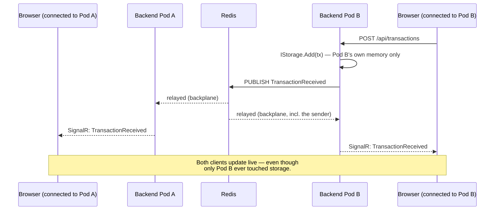

# ADR 0001: Cross-Pod Real-Time Synchronization via SignalR Redis Backplane

## Status
Accepted and **implemented** — see [DESIGN.md §20](../DESIGN.md#20-distributed-architecture) / §22 Phase 8. Verified with two separate backend containers sharing one Redis instance: a SignalR client connected only to instance A received a broadcast triggered by a `POST` sent only to instance B — the exact failure mode described below, now fixed.

Re-verified separately after `TransactionUpdated` (§10 in DESIGN.md) was added: the backplane relays every `IHubContext.SendAsync` call regardless of event name, but that's a claim about the mechanism, not evidence for this specific event — re-ran the same two-instance test with a `PUT .../status` sent only to instance B, and a client connected only to instance A received the `TransactionUpdated` broadcast. Confirms the backplane's cross-pod guarantee wasn't accidentally scoped to the one event it was originally proven against.

## Context
The backend is designed to be deployed as multiple replicas (pods) behind a Kubernetes Service (see `k8s/backend-deployment.yaml`, `replicas: 2`). Each pod runs its own independent SignalR server instance with its own in-memory connection registry.

## Problem
A client connected via WebSocket to Pod A is registered only in Pod A's local SignalR connection list. If a transaction is POSTed and load-balanced to Pod B, Pod B's `IHubContext<TransactionHub>.Clients.All.SendAsync(...)` only reaches clients connected to Pod B. The client on Pod A never receives the update — even though, from the outside, the system looks like a single service.

This is not a bug in our code; it is an inherent property of any stateful, in-process broadcast mechanism running across multiple isolated processes with no shared signaling channel between them.

Note: **session affinity ("sticky sessions") does not solve this.** It only guarantees a given client always reconnects to the same pod — it does nothing to propagate an event that originated on a *different* pod to that client's pod.

## Options Considered

| Option | Complexity | Reliability | Scalability | MVP Fit | Cloud Readiness |
|---|---|---|---|---|---|
| **SignalR Redis Backplane** (`Microsoft.AspNetCore.SignalR.StackExchangeRedis`) | Low — one NuGet package, one line of startup code | High — official, production-proven pattern (same mechanism Azure SignalR Service provides managed) | High for this workload | Excellent — purpose-built for exactly this problem | Excellent — works with any managed Redis (Azure Cache for Redis, AWS ElastiCache, or a Redis pod) |
| Message broker (Kafka / RabbitMQ) | High — new infra, producer/consumer plumbing, and we would still have to hand-write the per-pod relay-to-local-clients logic ourselves | High, but solving a different problem class (durable event streaming, not ephemeral live fan-out) | Very high — far beyond what this system needs | Poor — significant over-engineering relative to the actual requirement | Good, but heavy operational footprint |
| Shared DB + polling | Medium | Medium — polling interval introduces latency and risk of missed reads | Poor — read load scales with pods × poll frequency, not with actual data rate | Poor — reinvents pub/sub, worse than the real thing | Not idiomatic |

## Decision
Use the **official SignalR Redis backplane** (`AddStackExchangeRedis`). All backend pods connect to a shared Redis instance. When any pod's `IHubContext.SendAsync` is called, SignalR internally publishes the message to a Redis pub/sub channel; every pod (including the sender) is subscribed and relays the message to its own locally-connected clients.

```csharp
var redisConnectionString = builder.Configuration["Redis:ConnectionString"];
var signalRBuilder = builder.Services.AddSignalR();
if (!string.IsNullOrWhiteSpace(redisConnectionString))
{
    signalRBuilder.AddStackExchangeRedis(redisConnectionString);
}
```

The wiring is conditional on purpose: local `dotnet run` and the `WebApplicationFactory`-based integration tests boot the app without a real Redis instance, and shouldn't be forced to depend on one just to run a single-instance scenario that doesn't have the sync problem in the first place. `Redis:ConnectionString` is only set in `docker-compose.yml` and `k8s/backend-deployment.yaml`.

No change is required to `TransactionsController`, `TransactionService`, or `IStorage` — the backplane is entirely internal to the SignalR broadcast mechanism, which is exactly why keeping broadcast isolated behind `IHubContext` (see [DESIGN.md §11](../DESIGN.md#11-real-time-architecture)) pays off here.

### The mechanism, visually

The exact scenario from the Problem section above, with the fix in place — a client connected to Pod A receives a transaction that was POSTed to Pod B, without Pod A ever touching storage:



Notice what this diagram also makes visible: the storage write (`IStorage.Add`) happens once, only on Pod B. That's the exact boundary of what this ADR fixes — see "Scope" below for why a subsequent `GET /api/transactions` routed to Pod A would *not* see this transaction, even though Pod A's connected client just received it live.

## Scope — what this solves, and what it deliberately does not

**Solves:** live broadcast fan-out. A client connected to any pod now receives every `TransactionReceived` event, regardless of which pod handled the `POST` that produced it — verified directly (see Status above).

**Does NOT solve: cross-pod read consistency.** `IStorage` (`InMemoryTransactionStore`) remains a separate, unsynchronized instance per pod — the Redis backplane only carries the SignalR *event*, not the underlying data. Concretely: if a client's `GET /api/transactions` (e.g. on `/monitor`'s initial load, or a page refresh) is routed by the Kubernetes Service to Pod A, it will not see a transaction that was `POST`ed to Pod B, even though a client already listening live *would* have received that same transaction as a broadcast. The two endpoints have different consistency guarantees across pods, which is easy to miss since single-instance testing (or testing only the live-update path) never exposes it.

**Why this is left as a known limitation rather than fixed here:** closing this gap requires shared, consistent storage (an actual database, or at minimum a shared cache all pods read from) — which is precisely the persistence trade-off already made and justified in [DESIGN.md §13](../DESIGN.md#13-storage-design) (in-memory, no cross-restart/cross-process durability, because nothing in the assignment requires it). Fixing cross-pod read consistency without revisiting that decision would mean solving a bigger problem than this ADR is scoped to, in a system explicitly not going to production. A real rollout would need to solve storage and broadcast consistency together, not this backplane alone.

## Rationale
- It is the narrowest possible fix for the exact problem stated: it does not introduce durability, ordering, or streaming guarantees the system does not need.
- It is officially supported and documented by Microsoft for this precise scenario, minimizing implementation risk.
- It requires no changes to domain/service/storage code — the layering decided in earlier sections isolates the blast radius of this change to configuration and DI registration only.

## Consequences
- Adds a Redis dependency to both local (`docker-compose.yml`) and cluster (`k8s/redis-deployment.yaml`, `k8s/redis-service.yaml`) environments — added to *both* consistently, as required above; a partial implementation (e.g., only in docker-compose) would have misrepresented the system's actual cloud-readiness.
- Redis itself is a single replica (`k8s/redis-deployment.yaml`, `replicas: 1`) — it is not the thing being scaled or made highly available in this MVP; only the backend's stateless pods are. A production rollout would want a managed/highly-available Redis instead.
- Session affinity at the Ingress/load-balancer level remains a complementary recommendation for connection *stability* in a full production rollout, but is out of scope here since no Ingress resource was introduced (see [DESIGN.md §19](../DESIGN.md#19-kubernetes)).
